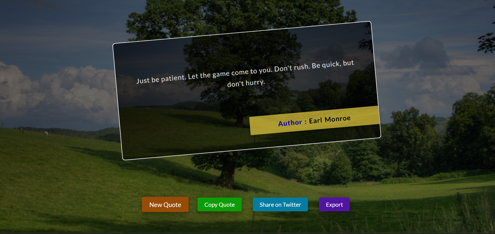

# Random Quote Generator

## Overview
This project is a simple website that fetches and displays a random quote from an API. Users can generate new quotes, copy them to the clipboard, share them on Twitter, and even export them as an image.

## Features
- **Fetch a random quote** from the API.
- **Display the quote** along with the author's name.
- **Random Background** change when new click on new quote button
- **New Quote Button** to fetch and display another random quote.
- **Copy Quote Button** to copy the displayed quote.
- **Share on Twitter Button** to share the quote on Twitter.
- **Random Background Image** for each new quote.
- **Export Button** to download the quote as an image.

## API Endpoint
Quotes are fetched from the following API:
```
https://api.freeapi.app/api/v1/public/quotes/quote/random
```

## Technologies Used
- HTML
- CSS
- JavaScript
- [html2canvas](https://html2canvas.hertzen.com/) (for screenshot functionality)

## Setup Instructions
1. Clone the repository:
   ```bash
   git clone https://github.com/your-repo/random-quote-generator.git
   ```
2. Navigate to the project folder:
   ```bash
   cd random-quote-generator
   ```
3. Open `index.html` in your browser.

## How It Works
1. When the page loads, a random quote is displayed.
2. Clicking the **New Quote** button fetches a new quote.
3. Clicking the **Copy** button copies the quote to the clipboard.
4. Clicking the **Twitter Share** button opens Twitter with a pre-filled tweet.
5. Clicking the **Export** button downloads the quote as an image.

## Files Structure
```
project-folder/
│── index.html       # Main HTML file
│── style.css        # Styling file
│── script.js        # JavaScript file
│── images/          # Background images folder
└── README.md        # Project documentation
```

